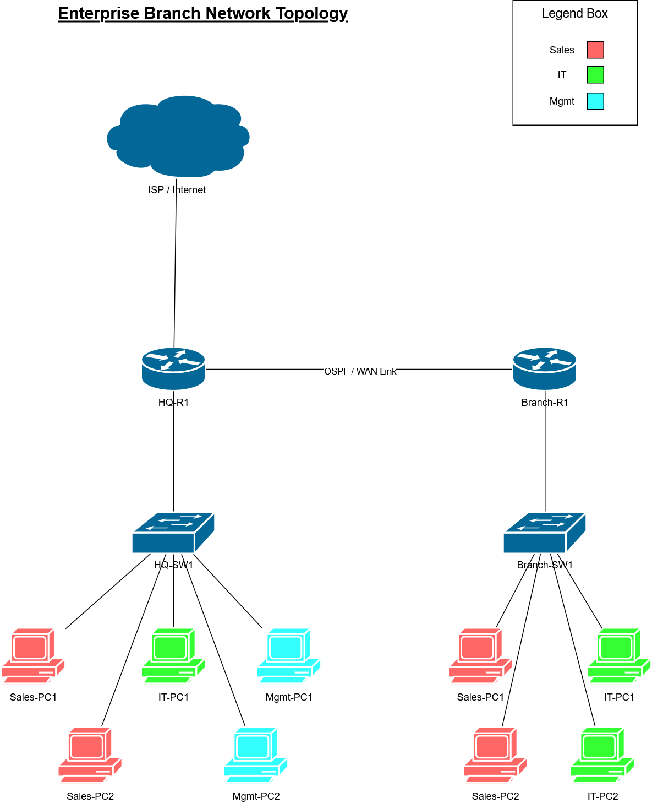

# Enterprise Branch Network Lab

A hands-on network engineering project simulating a two-site enterprise network for a fictional logistics company, built to demonstrate practical CCNA-level skills: VLAN segmentation, inter-VLAN routing, OSPF, NAT/PAT, ACLs, and device hardening.

---

## Project Scenario

A small company with a Head Office (HQ) and one Branch Office, connected over a WAN link, with internet access provided through a simulated ISP at HQ. The design requirements were:

- Separate VLANs for Sales, IT, and Management at each site
- Inter-VLAN routing via router-on-a-stick
- OSPF for dynamic routing between HQ and Branch
- NAT/PAT so internal hosts can reach the internet
- An ACL restricting the Sales VLAN from reaching the Management VLAN
- DHCP served per VLAN
- Device hardening: SSH-only access, restricted to the IT subnet, with encrypted passwords and a login banner

---

## Topology



| Segment | Network | Gateway |
|---|---|---|
| HQ VLAN 10 — Sales | 10.10.10.0/24 | 10.10.10.1 |
| HQ VLAN 20 — IT | 10.10.20.0/24 | 10.10.20.1 |
| HQ VLAN 30 — Management | 10.10.30.0/24 | 10.10.30.1 |
| Branch VLAN 10 — Sales | 10.20.10.0/24 | 10.20.10.1 |
| Branch VLAN 20 — IT | 10.20.20.0/24 | 10.20.20.1 |
| HQ ↔ Branch WAN Link | 10.0.0.0/30 | — |
| HQ ↔ ISP Link | 203.0.113.0/30 | — |
| ISP Loopback (test destination) | 8.8.8.8/32 | — |

---

## Technologies Implemented

- **VLANs & Inter-VLAN Routing** — router-on-a-stick using subinterfaces per VLAN
- **OSPF (Single Area)** — dynamic routing between HQ-R1 and Branch-R1, with a default route redistributed via `default-information originate` so Branch can reach the internet through HQ
- **NAT/PAT (overload)** — internal networks translated to a single public-facing address on HQ-R1's ISP-facing interface
- **DHCP** — per-VLAN address pools for end devices
- **Extended ACLs** — bidirectional isolation between Sales and Management VLANs, applied inbound on both source interfaces
- **Device Hardening**:
  - SSH-only management access (Telnet disabled)
  - SSH restricted to the IT subnet only, via `access-class` on the VTY lines
  - Encrypted passwords (`enable secret`, `service password-encryption`)
  - Login banner
  - Idle session timeout

---

## Repository Structure

```
enterprise-branch-network-lab/
├── README.md
├── /diagrams
│   └── topology.png
├── /configs
│   ├── HQ-R1-config.txt
│   ├── Branch-R1-config.txt
│   ├── HQ-SW1-config.txt
│   └── Branch-SW1-config.txt
├── /screenshots
│   ├── ospf-neighbors.png
│   ├── nat-translations.png
│   ├── acl-verification.png
│   └── ssh-restriction-test.png
└── troubleshooting-case-study.md
```

---

## Verification Performed

- `show ip ospf neighbor` confirms full adjacency between HQ-R1 and Branch-R1
- `show ip route` confirms all VLAN subnets and the default route are being learned/advertised correctly
- `show ip nat translations` confirms internal hosts are being translated to the public-facing address when reaching the simulated internet (ISP loopback)
- `show access-lists` confirms the Sales↔Management ACL is actively matching and blocking traffic in both directions, while Sales↔IT remains unaffected
- SSH login succeeds from an IT subnet host and is refused (connection-level, not just authentication-level) from Sales/Management hosts
- Telnet is refused entirely on all VTY lines

Screenshots of each verification step are in `/screenshots`.

---

## Troubleshooting Case Study

During implementation, an ACL intended to block only Sales→Management traffic unexpectedly blocked Management→Sales traffic as well, followed by a second, related issue where the fix wasn't taking effect on all interfaces. Full diagnosis, root cause, and resolution are documented in [`troubleshooting-case-study.md`](./troubleshooting-case-study.md) — this is the piece I'd point to first if asked "tell me about a time you troubleshot a network issue."

---

## Design Notes & Trade-offs

- **ACLs are stateless by nature.** Achieving the Sales/Management isolation required bidirectional deny rules applied on both source interfaces, rather than a single directional rule — a limitation explained in detail in the troubleshooting case study.
- **Management VLAN does not have SSH access to network devices** in this design — only the IT subnet does, reflecting a deliberate separation-of-duties decision (IT manages the network; Management does not have direct device access). This is configurable if the intended policy differs.
- **Credentials shown in configs are lab-only** and would never be committed to a real production repository. In a production environment, device authentication would be handled through a centralized AAA server (e.g., TACACS+/RADIUS) rather than local usernames.
- **The ISP is simulated with a generic router**, since simulation tools like Packet Tracer don't provide a fully functional "cloud" object for realistic NAT/routing testing.

---

## Tools Used
- Cisco Packet Tracer
- draw.io (topology diagram)

## About
Built as a personal project to apply CCNA concepts in a practical, end-to-end network design. Feedback welcome — feel free to open an issue or reach out.
